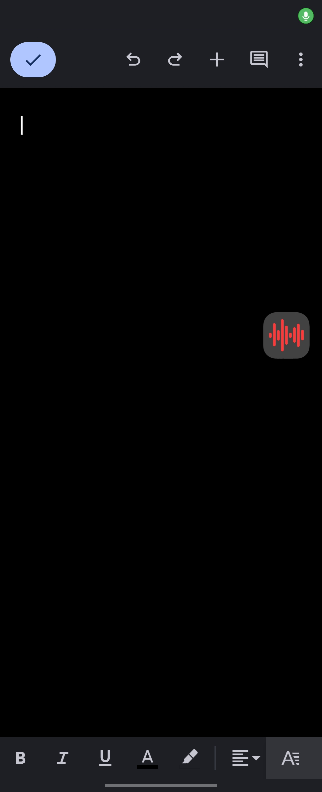
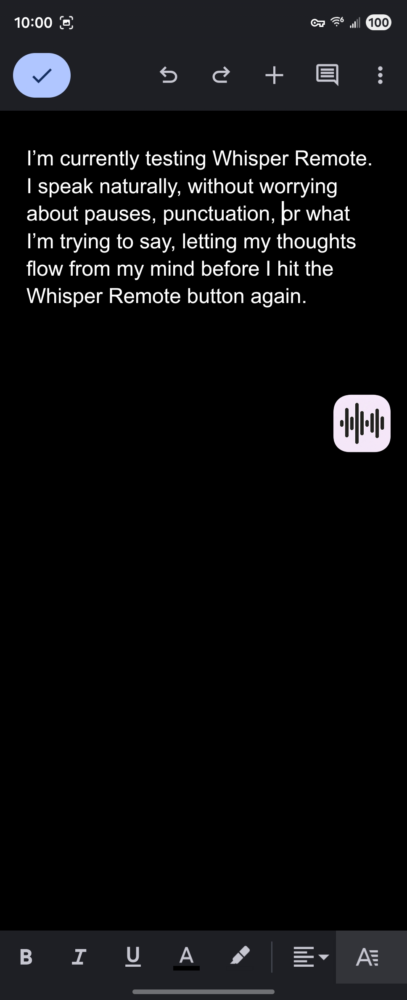
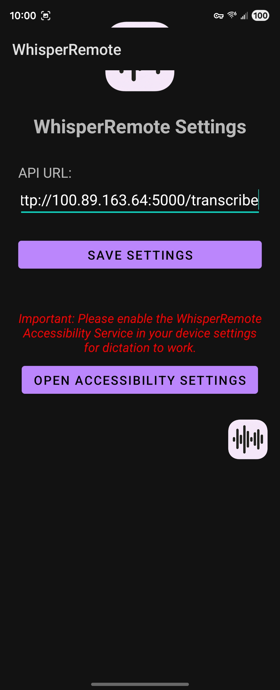

# Faster Whisper API & Background Listener

**Why I built this:** I got sick of poor transcription tools, and I was tired of manually dictating punctuation. Worse: watching words appear on-screen in real-time broke my train of thought, especially when a word was mistranscribed.

I just wanted a tool where I could hit a button, "word vomit" my thoughts into a text field, and hit Enter—without being distracted by the transcription process. This tool is designed to be completely invisible until it drops the finished, perfectly punctuated text.

**_UPDATE_**
Added feature: say 'prompt ai' followed by instructions and it will use Ollama (or other local LLM) to edit the text per your instructions.

Potential use: _hit record_ "The movie is Wednesday, I mean Tuesday, actually... Thursday at noon... Prompt AI, can you make that clear about it being Thursday?" _hit stop_ -> outputs -> "The movie is Thursday at noon."

**_UPDATE 2_**
Added Feature: Android app - local open source version of wispr flow with a floating button to press to record and press to stop. Record as long as you want with no pressure to keep going before it cuts you off. Also works with the 'prompt ai' feature.

<p align="center">
  
  
  
</p>

Running the `small` Whisper model on CUDA (using ~0.6GB of VRAM) with a cheap $12 used Blue microphone off eBay, this thing is _dang near perfect_. It handles long pauses and auto-punctuation with near-zero issues. For how often I use it, it is worth every megabyte of VRAM.Easily start/stop the service from a system tray icon (bottom right corner by your clock)

## Features

- **Local API**: Fast transcription using CTranslate2 and ONNX.
- **Background Listener**: Use the backtick (`` ` ``) to start and stop recording. (top left of keyboard, directly under the Esc key)
- **Context Menu Integration**: Right-click any audio and most video files in Windows Explorer to "Transcribe to Clipboard".
- **Android App**: Local open source version of wispr flow with a floating button to press to record and press to stop. Record as long as you want with no pressure to keep going before it cuts you off. Also works with the 'prompt ai' feature.
- **Windows Service**: The API runs as a background service that starts automatically when you log in and restarts itself if it crashes.
- **Windows Tray Icon**: The API runs as a background service that starts automatically when you log in and restarts itself if it crashes.

---

## Installation

### 1. Prerequisites

- **Python 3.8+**
- **NVIDIA GPU** with CUDA (recommended) or a fast CPU.
- **~1.5 GB Free Disk Space**: The first time you launch the application, it will automatically connect to HuggingFace to download the AI model weights. Depending on your internet speed, the very first launch may appear to hang for several minutes while it downloads.

### 2. Setup Environment

```powershell
# Create virtual environment
python -m venv .venv

# Activate environment
.\.venv\Scripts\Activate.ps1

# Install dependencies
pip install -r requirements.txt
```

### 3. Configuration

**Environment Setup:**  
Copy the default `.env.example` to `.env` to suit your hardware.

```powershell
copy .env.example .env
```

Open `.env` to configure your `WHISPER_MODEL_SIZE`, `WHISPER_DEVICE`, and background service settings.

**Name Auto-Corrections & AI Triggers:**  
The API automatically corrects specific names and catches "trigger words" to send to an external AI editing loop. To customize these rules:

```powershell
copy processing_config.example.json processing_config.json
```

Open `processing_config.json` to safely edit your own name corrections and AI trigger words.

---

## Usage Modes

This application can run in two different ways depending on your preference.

### Option 1: Foreground Terminal Mode (Simple, but visible)

By default, the system runs as visible applications.

- **What this means:** When you double-click `LAUNCHER.bat`, a black command prompt window opens and stays on your taskbar.
- **The downside:** Every time you open the terminal, you have to wait 10-20 seconds for the massive AI model to load into your graphics card (VRAM). If you close the black window, the transcription stops working.
- **How to use:** Just open your `.env` file and make sure `API_VISIBLE=true` is set. Then double-click `LAUNCHER.bat`.

### Option 2: Background Windows Service ("Always-On" & Invisible)

This is the recommended way to use the app for a seamless experience.

- **Why do I want this?** The AI model is _always hot_ and waiting in your memory. When you hit the keyboard shortcut to record, it transcribes instantly. There are no ugly black terminal windows cluttering your taskbar. It also auto-restarts itself safely in the background to prevent your PC from slowing down over the weeks.
- **What happens if I don't use this?** You'll just have to use "Option 1". You must keep a black terminal window open at all times, and wait for the AI to load every time you start it. You don't need to understand how the service works, just that it hides everything and makes it instantly available 24/7.
- **How to install:**
  1. Open your `Faster_Whisper_API` folder in Windows Explorer.
  2. Find the file named `install_service.ps1`.
  3. **Right-click** `install_service.ps1` and select **"Run with PowerShell"**.
     - _(If it asks for Administrator permissions or says "Do you want to allow this app to make changes", click **Yes**)._
     - _(Alternative: Click the Start button, type "PowerShell", right-click it and choose "Run as Administrator". Then type `cd C:\path\to\Faster_Whisper_API\scripts` and hit enter, then type `.\install_service.ps1` and hit enter)._
  4. Follow the prompts in the blue window until it says "Service installed successfully".
  5. Open your `.env` file (notepad is fine) and change `API_VISIBLE=true` to `API_VISIBLE=false`. Save it.
  6. Double-click `LAUNCHER.bat`. From now on, you will only see a tiny red circle in your System Tray (by the clock), which manages the invisible background listener.
  7. _(Optional but Highly Recommended)_ To make the tiny red circle listener start every time you log into your PC, open your `Faster_Whisper_API` folder, right-click `install_listener_startup.ps1`, and hit **"Run with PowerShell"**. Now the entire system is 100% hands-off!

---

## How to Transcribe

Once the system is running (either via Option 1 or Option 2):

- **Action**: Press " ` " (backtick) to start recording. Press it again to stop. (That button below the "Esc" key on your keyboard that you never use)
- **Result**: The audio is sent to the local API, transcribed, copied to your clipboard, and automatically pasted wherever your cursor currently is (after automatically hitting backspace twice to delete the two backticks you used to start/stop the recording).

---

## Windows Integration

### 1. Right-Click Context Menu

To add "Transcribe to Clipboard" to your right-click menu for audio files, simply run the setup script as Administrator:

```powershell
.\install_context_menu.ps1
```

_Note: Ensure you have run the Python setup steps above first, as this relies on the virtual environment's pythonw.exe._

## Project Files

- `whisper_api.py`: The FastAPI backend server.
- `background_listener.py`: The hotkey monitoring tool with a "Transcribing..." overlay.
- `transcribe_file.py`: Helper script for the right-click context menu.
- `LAUNCHER.bat`: Primary launcher to switch between foreground/background modes.
- `install_service.ps1`: Automated installer to wrap the API as a Windows NSSM service.
- `install_context_menu.ps1`: Automated installer for the Explorer right-click integration.
- `.env`: Configuration settings for the model, device, and service behaviors.
- `.gitignore`: Configured to ignore virtual environments and common AI agent files (`agent.md`, `claude.md`, etc.).

---

## Troubleshooting

### Accessing the API from Other Devices (Tailscale / LAN)

If you installed the API using `install_service.ps1` to run in the background (Option 2), the Windows Service uses NSSM and is restricted to `localhost` (`127.0.0.1`) by default for security to prevent unwanted local access to your system.

If you want to reach the API from your phone or another computer (like over Tailscale), you will get no response until you bind the service to your network interfaces.

**The Fix:**

1. Open `install_service.ps1` in a text editor (like VS Code or Notepad).
2. Find the line that looks like: `... --host 127.0.0.1 --port 5000`
3. Change `127.0.0.1` to `0.0.0.0`.
4. Run `install_service.ps1` again as Administrator to apply the change to the background service. _(Ensure Windows Firewall allows TCP Port 5000)._

---

## Acknowledgments and Attributions

This project relies on several fantastic open-source libraries:

- [Faster-Whisper](https://github.com/SYSTRAN/faster-whisper) (MIT License) - Core transcription engine.
- [FastAPI](https://github.com/tiangolo/fastapi) (MIT License) - Web framework for the API.
- [Uvicorn](https://github.com/encode/uvicorn) (BSD 3-Clause) - ASGI web server.
- [NSSM - the Non-Sucking Service Manager](http://nssm.cc/) (Public Domain) - Used for background Windows Service management.
- [Requests](https://requests.readthedocs.io/) (Apache 2.0) - HTTP library.
- [Keyboard](https://github.com/boppreh/keyboard) & [SoundDevice](https://github.com/spatialaudio/python-sounddevice) (MIT License) - Hotkey and audio capture integration.
- Other helpful libraries including `numpy`, `scipy`, `pyperclip`, `pywin32`, and `python-dotenv`.
